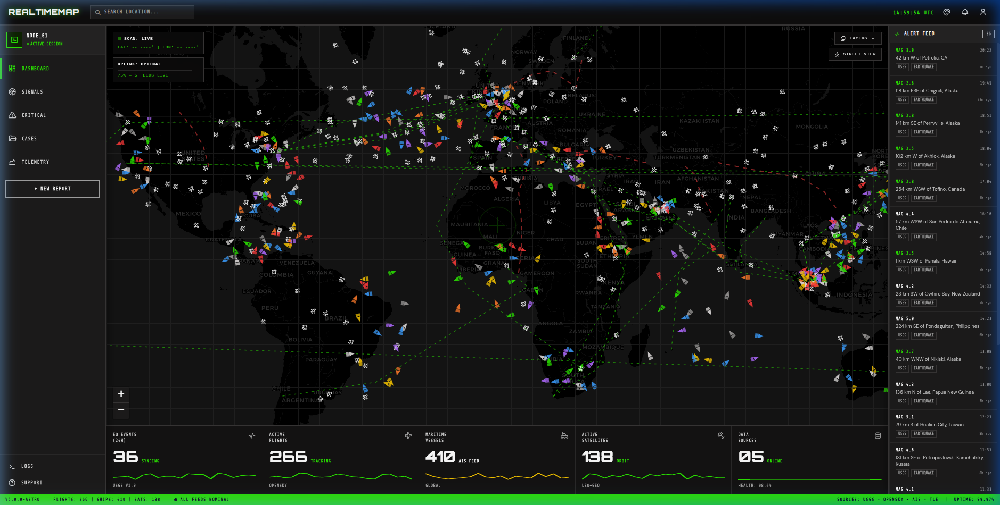

# RealtimeMap Astro 🛰️

A high-performance, cyberpunk-themed interactive geospatial dashboard built with Astro, Leaflet.js, and TypeScript.



## 🌐 Live Demo
Check out the live dashboard here: [realtimemap-astro.vercel.app](https://realtimemap-astro.vercel.app)

## ✨ Features
- **Real-time Telemetry**: Track global flights, maritime vessels, and orbital satellites in real-time.
- **Cyberpunk Aesthetic**: High-fidelity dark mode with neon accents and futuristic UI elements.
- **Interactive Map Layers**: Toggle between Professional Dark Gray, Satellite, Terrain, and Standard OpenStreetMap layers.
- **Live Feed Panel**: Automated alerts for global seismic events (earthquakes) and simulated tactical data.
- **Custom Map Engine**: Seamless geospatial rendering using Leaflet.js with optimized tile loading.
- **Responsive HUD**: Real-time coordinate tracking and telemetry metrics display.

## 🛠️ Built With
- **Framework**: [Astro](https://astro.build/)
- **Map Engine**: [Leaflet.js](https://leafletjs.com/)
- **Styling**: Vanilla CSS & TailwindCSS
- **Deployment**: [Vercel](https://vercel.com)

## 🚀 Getting Started

1. **Clone the repository:**
   ```bash
   git clone https://github.com/Aditya-singh095/realtimemap-astro.git
   ```

2. **Install dependencies:**
   ```bash
   npm install
   ```

3. **Run the development server:**
   ```bash
   npm run dev
   ```

4. **Build for production:**
   ```bash
   npm run build
   ```

---
Built with 💚 for the Cyberpunk Geospatial community.
